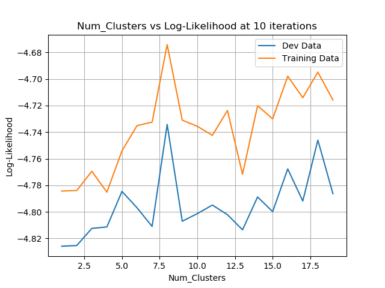

# Mixture of Gaussians
## Patrick Phillips

This project implements the expectation maximization (EM) algorithm for a mixture of gaussians model. The EM algorithm derivation can be found at [CSC 446 Machine Learning Lecture Notes](https://www.cs.rochester.edu/~gildea/2019_Spring/notes.pdf). Using a mixture of gaussian model in expectation maximization is extremely common, and the EM algorithm in this case iteratively updates the covariance matrix, and mean and weight of each cluster. Here is a video displaying how the algorithm learns the means, run on a two dimensional data set run with 10 clusters (the red plus represents the mean of the cluster).



After experimenting with different usage of hyperparameters I first found that increasing clusters was useful, but slowly plateaued.
Increasing clusters did not help much after about 10 clusters, and there was overfitting that occured around 30 clusters varying with the number of iterations used.
I also found more iterations had a similar effect most often. Often too many iterations could cause overfitting as well, or just plateau improvement.
I used development data in my final implementation to first choose the optimal number of clusters, and then choose an optimal number of iterations.
This usage of devlopment data seemed intuitive to me as it: 
(1) checks how many clusters can really effectively capture what patterns the data holds, and 
(2) finds how much those clusters need to be trained (how many iterations).
I have many graphs attatched with labels indicating what parameters were fixed and which were varied and plotted. Here is one that plots the log likelihood(likelihood of the test data given the model) versus the number of iterations:

.png)

And here is another plotting the log likelihood versus the number of clusters (after 10 iterations of updates):

